# 💼 Portail Freelance-Client

Un portail complet et en temps réel de gestion de projet entre Freelances et Clients, conçu comme Projet de Fin d'Études (PFE). Cette plateforme professionnelle facilite la collaboration en direct grâce à un suivi de projet intégré, une messagerie instantanée, le partage de documents, des annotations en direct sur les fichiers, la signature électronique de contrats, la facturation/paiement via Stripe, et des visioconférences Peer-to-Peer intégrées.

---

## 🏗️ Architecture du Système & Flux de Travail

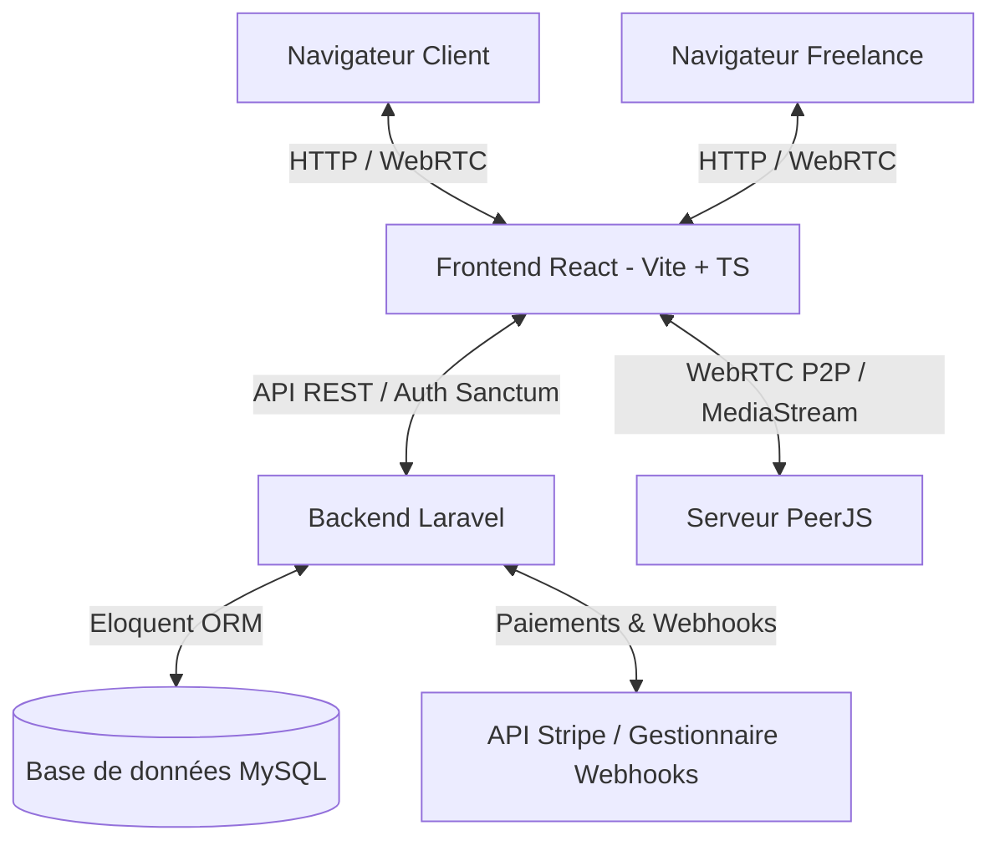

---

## 🛠️ Technologies Utilisées

La plateforme s'appuie sur une architecture moderne et découplée :

### 🗄️ Backend (API Laravel 11)
- **Framework** : Laravel 11
- **Authentification** : Laravel Sanctum (Authentification par jeton/token)
- **Base de données** : MySQL avec Eloquent ORM
- **Gestion des paiements** : Intégration de l'API Stripe
- **Génération PDF** : Exportation de factures au format PDF

### 💻 Frontend (React 18 + Vite)
- **Outil de build** : Vite
- **Langage** : TypeScript
- **Composants UI** : Shadcn UI & Tailwind CSS
- **Gestion d'état & Routage** : React Context API & React Router
- **WebRTC** : Client PeerJS pour les appels vidéo P2P de navigateur à navigateur

---

## ✨ Fonctionnalités Clés

### 1. Tableaux de Bord Dédiés
*   **Tableau de bord Freelance :** Gérer les fiches clients, consulter les statistiques de gains cumulés, suivre les projets actifs, vérifier l'état des factures et planifier les réunions.
*   **Tableau de bord Client :** Consulter les projets attribués, approuver les étapes importantes (jalons), signer les contrats, payer les factures via Stripe et télécharger les livrables.

### 2. Suivi de Projets & Jalons (Milestones)
*   **Cycle de vie structuré :** Progression des projets à travers différents statuts (`pending`, `in_progress`, `completed`, et `canceled`).
*   **Jalons granulaires :** Découpage des projets en étapes clés avec des dates limites, des fichiers associés et un espace de commentaires dédié pour chaque jalon.

### 3. Communication en Temps Réel
*   **Messagerie instantanée :** Canaux de discussion privés avec partage d'images et de documents.
*   **Appels vidéo WebRTC :** Appels vidéo/audio P2P intégrés via PeerJS, ne nécessitant aucun plug-in externe. Fonctionnalités incluses : notification d'appel entrant, gestion des statuts (sonnerie, accepté, rejeté) et historique des appels.
*   **Indicateur de présence :** Suivi de l'activité en temps réel grâce aux pings (`/presence/ping`), affichant le statut connecté ou la dernière heure de connexion.

### 4. Partage de Fichiers & Annotations Visuelles
*   **Bibliothèque centrale :** Téléversement et organisation des documents de projet.
*   **Aperçus annotés :** Ajout de commentaires et d'annotations graphiques directement sur les coordonnées précises des documents partagés (PDF, images, etc.).

### 5. Intégration Financière & Juridique
*   **Facturation numérique :** Création et gestion des factures professionnelles.
*   **Paiement Stripe :** Intégration sécurisée de Stripe Checkout, accompagnée d'une passerelle de simulation (Mock Gateway) pour tester les paiements en local.
*   **Signature de contrats :** Édition de contrats en ligne que les clients peuvent examiner et signer numériquement.

### 6. Système de Notifications
*   **Notifications système :** Alertes en temps réel pour les nouveaux messages, approbations de jalons, rappels de factures et signatures de contrats.

---

## 📁 Structure du Projet & Rôle des Fichiers

### 🗄️ 1. Application Backend (`backend/`)

*   **`Http/Controllers/Api/`** : Contrôleurs gérant les points d'accès de l'API REST :
    *   `AuthController.php` : Gestion des inscriptions, connexions, vérifications d'e-mails, réinitialisations de mots de passe et statut de présence.
    *   `ChatController.php` : Gestion des salons de discussion, messages et pièces jointes.
    *   `ClientController.php` : Intégration des clients, invitations et profils.
    *   `ContractController.php` : Création de contrats, stockage et signatures électroniques.
    *   `DashboardController.php` : Agrégation des statistiques pour les tableaux de bord.
    *   `InvoiceController.php` : Gestion des factures, intégration Stripe Checkout, traitement des webhooks et paiements de démonstration.
    *   `MeetingController.php` : Programmation de réunions et suivi des appels.
    *   `MilestoneController.php` & `MilestoneFileController.php` : Avancement des jalons et dépôt des livrables.
    *   `NotificationController.php` : Notifications internes de l'application.
    *   `ProjectController.php` & `ProjectFileController.php` : Gestion des profils de projet, budgets, délais et stockage des fichiers.
    *   `ProjectFileAnnotationController.php` : Gestion des annotations interactives coordonnées X/Y sur les fichiers partagés.
    *   `VideoCallController.php` : Lancement d'appels, réceptions et journalisation de l'historique.

### 💻 2. Application Frontend (`frontend/`)

*   **`src/pages/`** : Pages clés de l'interface utilisateur :
    *   `landing-page.tsx` : Page d'accueil publique présentant la plateforme.
    *   `login-page.tsx` & `register-page.tsx` : Authentification et création de compte.
    *   `dashboard-page.tsx` & `client-dashboard-page.tsx` : Espaces de travail personnalisés selon le rôle.
    *   `clients-page.tsx` & `projects-page.tsx` : Listes et gestion des clients et projets.
    *   `project-details-page.tsx` & `client-project-details-page.tsx` : Pages de détails interactifs du projet.
    *   `chat-page.tsx` : Espace de messagerie instantanée en direct.
    *   `meetings-page.tsx` : Calendrier interactif de planification des réunions.
    *   `video-call-page.tsx` : Interface d'appel vidéo WebRTC en plein écran.
    *   `preview-page.tsx` : Lecteur de documents PDF avec outils d'annotation.
    *   `mock-stripe-checkout-page.tsx` : Simulation de paiement Stripe en mode test.

---

## 📸 Aperçus de la Plateforme (Screenshots)

### 🌐 1. Accueil & Présentation
*   **Page d'accueil (Landing Page) :** Page d'accueil publique moderne intégrant des animations interactives et un commutateur de thème (Sombre/Clair).
    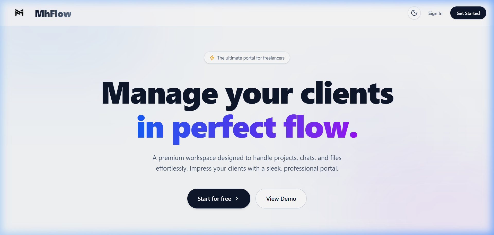

### 💼 2. Espace Freelance (Freelancer Space)
*   **Tableau de bord Freelance :** Analyse graphique des revenus cumulés, suivi des clients actifs, des projets en cours et des échéances de jalons.
    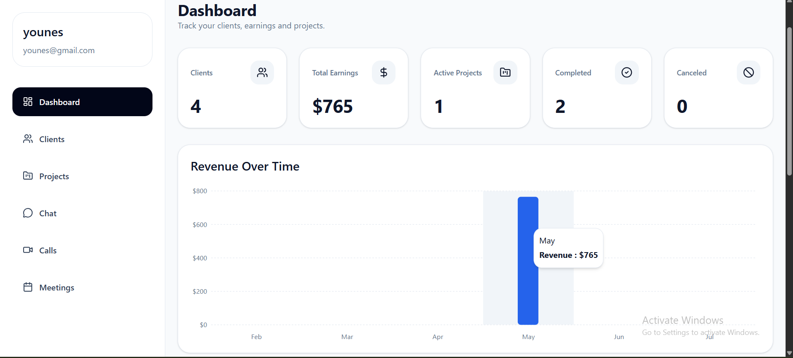
*   **Gestion des Clients :** Liste des clients intégrés et suivi des invitations envoyées.
    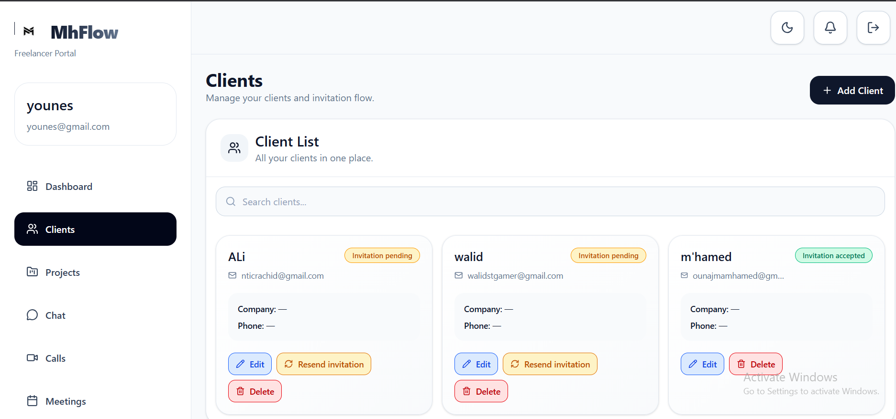
*   **Suivi des Projets :** Liste exhaustive et filtre des projets actifs avec leurs budgets et états d'avancement.
    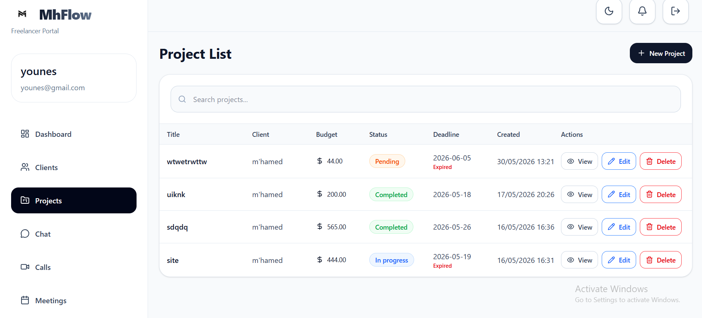
*   **Planification des Réunions :** Calendrier interactif permettant de fixer des rendez-vous et de planifier des visioconférences.
    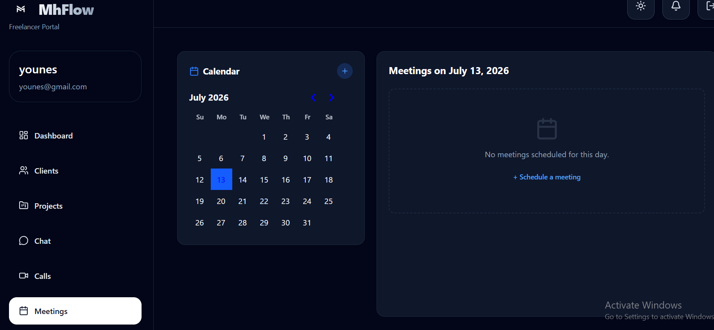

### 🤝 3. Espace Client (Client Space)
*   **Tableau de bord Client :** Synthèse complète des projets assignés, suivi des dépenses financières et accès rapide à la messagerie.
    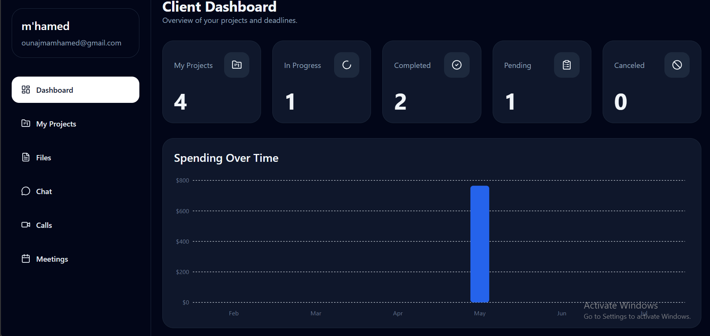

### ⚙️ 4. Collaboration & Gestion de Projet (Project details)
*   **Aperçu du Projet :** Fiche descriptive du projet contenant les budgets, les délais et les métadonnées globales.
    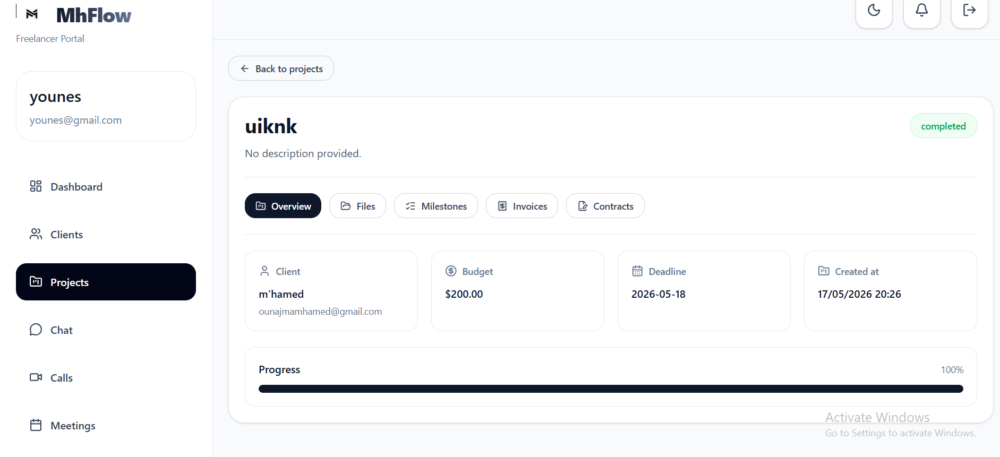
*   **Partage de Fichiers :** Zone centrale de stockage et de partage sécurisé de documents et de livrables.
    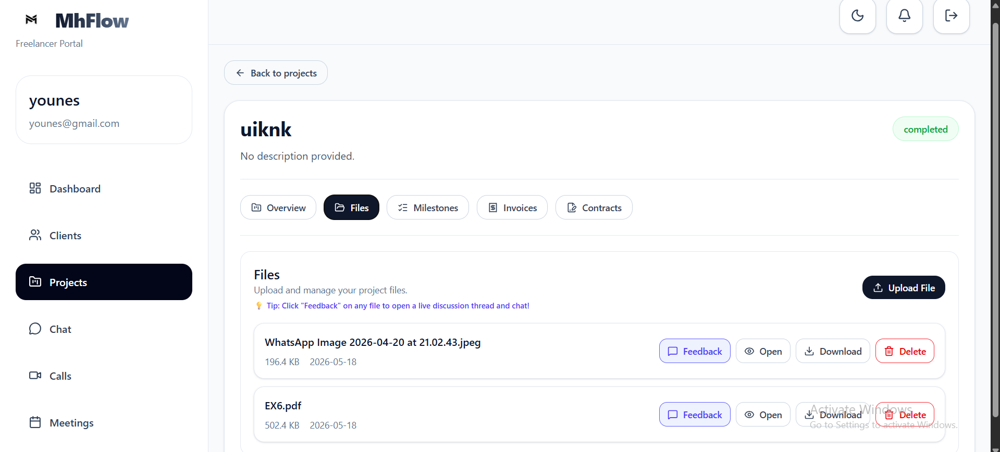
*   **Suivi des Jalons (Milestones) :** Découpage du projet en étapes clés, avec téléchargement des livrables et commentaires.
    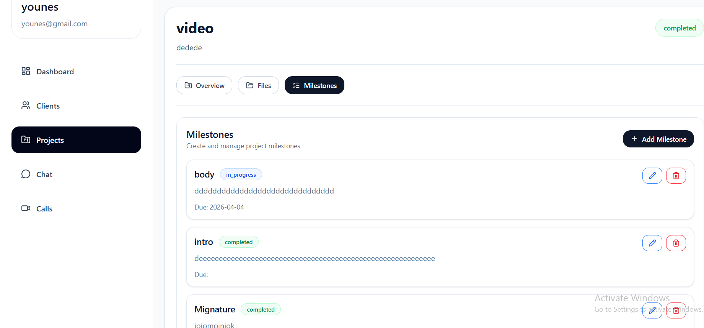
*   **Factures & Paiements :** Liste de facturation avec leur état (Payé/En attente) et intégration de la simulation Stripe Checkout.
    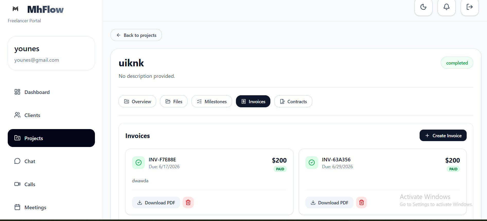
*   **Générateur de Contrats :** Outil de rédaction, d'approbation et de signature électronique sécurisée en ligne.
    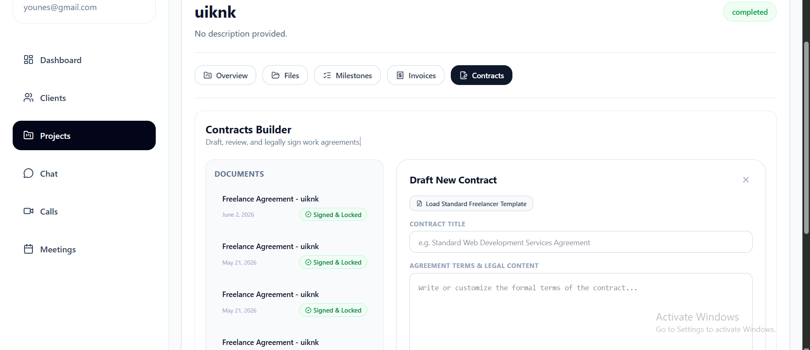

### 💬 5. Communication en Temps Réel
*   **Messagerie Instantanée :** Service de discussion par canaux privés pour une interaction rapide et instantanée.
    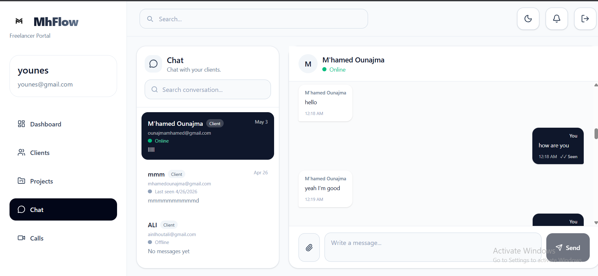
*   **Gestion des Appels :** Espace de journalisation de l'historique d'appels et liste des correspondants disponibles pour appel.
    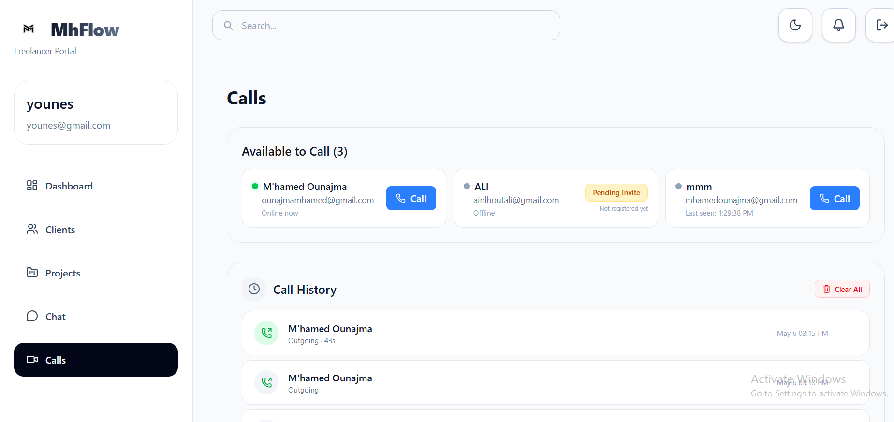
*   **Visioconférence Peer-to-Peer :** Module d'appel vidéo et audio en temps réel basé sur WebRTC (via PeerJS), sans plug-in requis.
    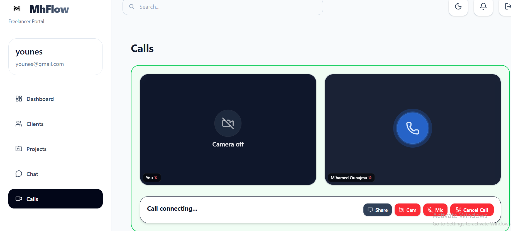

